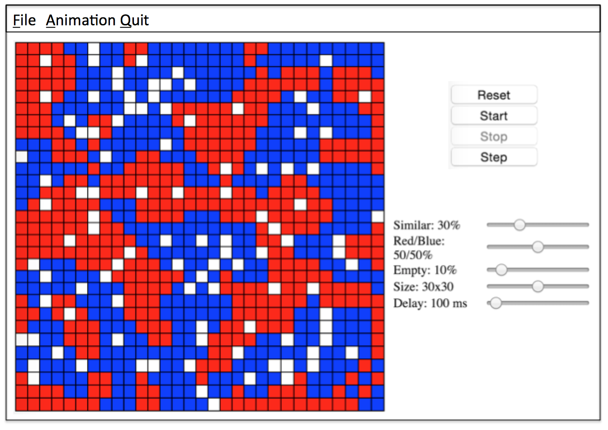

#Design

##Introduction
The primary goal of our project is to make an easily extensible Cellular Automata Java
application.  There will only be one part of the code that is closed, and that is the
general gameplay.  Our goal is to have every single other part of the game open to
extension.  The gameplay class will simply call general methods in other classes that
can be implemented with subclasses.  This way, it is very easy to add new rules and
make design changes without needing to modify the gameplay class extensively.  New
models, cell types, and cell states will be implemented very simply by adding
subclasses. In the beginning, there will be a model for every CellSociety type.  In
addition, there will be a cell type that goes along with each model. Finally, for each
cell type, there will be a series of cell states that the cells can be in.  Each cell 
will be able to have a single state at any time.

##Overview
This program will have 5 main pieces.  Those pieces are the game, the grid, the model,
the cells, and the cell states.  All pieces except the game will be extensible.  They
will be built in such a manor that adding a new mode to the game is as easy as
extending a single class, and adding no more than a line or two of code somewhere to
instantiate that class.

The first piece is the game.  The game will be composed of two very simple, dumb
classes.  The first class is a game manager class.  This class will simply be
responsible for instantiating the mode and other objects, and making sure they all
work together.  The game will have a step method that is called every so often.
This step method will then call the step methods of everything else that moves
on the screen, and cheks the return of those step functions to make sure everything
is functioning properly and the simulation has not ended.  In addition to the game
manager class, there will also be an xml parser class.  This class will take in a
filename, and the return will be a data structure of some sort containing the xml
information.

The second piece is the grid.  The grid is likely the most simple of the models,
however, it can be extended.  The default grid will simply be a square or
rectangular grid in which each block has 8 neighbors, and each block can query
the state of its neighbors.  This can be subclassed, however, to any orientation
or shape of cells.  This is convenient for shapes that don't necessarily have
8 neighbors.

The third piece is the model.  This is arguably the most important part of
Cell Society as it defines the way that the simulation is run.  It is the
brains of all operations that happen on the cell level.  Different subclasses
of model will have different ways of controlling cells, their states, and the
grid.  Input from the terminal or the xml file will determine which type of
model object to instantiate.

Fourthly, the cell class will containt the information about each cell in the
cell society.  These cells will all have a specific loation on the grid, and
variables indicating its current state.  It will also have an init method and a 
method that will change the current state of the cell to the next state that
the cell needs to be in.  Subclasses of the main cell will also be able to have
different parameters and different ways to interact with other cells.

Finally, each cell will have an instance variable of their state.  This cell
state class will contain all information the cell needs to know about its
current state.  The default states are on and off, but like the other classes,
cell state can also be extended. If sometime in the future, a model is created
where there need to be cells with three possible states, this will not be
difficult to implement because it simply requires writing a new subclass.

## User Interface
The main screen of the program contains five blocks. As seen from the screenshot below, there is a menu toolbar on the top. The grid is displayed on the left. On the right panel, there are control buttons, sliders/input boxes for adjusting animation parameters and a graph display area for plotting some relevant statistics.

**File menu contains the following:**
* New Animation
* Save XML
* Open XML
* (Save Screenshot)
* (Save Graph)

**Animation menu contains the following:**
* Start
* Stop
* Reset

The slider panel is unique for each type of animation.

Erroneous situations:

1.	File name exists when saving: ask user whether to overwrite or not; if not, return to saving screen to change file name

2.	Corrupted XML file when opening XML: when user clicks OK, return to file selection window and ask user to select a new file

3.	Parameters in the XML file out of range: when user clicks OK, return to file selection window and ask user to select a new file

## Design Details

##Design Considerations
Our highest design consideration will mainly focus on the extendibility of our code. All conditions for each cellular automata model (CA) will be specified in our XML file. Thus, we must take into consideration all potential conditions and how to interpret them into useful and volatile parameters in our code. 

The primary conditions our group discussed in preparing for the design of our game include the rules for change in cell state and the number of possible states a cell can hold. For both these conditions, we decided it would be necessary to create separate classes for these as these conditions differ greatly from model to model. We will call these the “Model” class and the “States” class as reference. 

While this will create more classes in our project and potentially high dependency within classes, we decided that this method would be most effective when we are challenged to extend our code to other models. For example, the Model class will probably have dependencies on the States class and Cell class, using get methods from the States class to determine a current state, and change a state based on a set of rules defined in Model.  

Furthermore, we decided that Model should be an abstract class, with the different types of models (ex. Schelling’s segregation model, Wa-tor prey-predator model, etc.) extending the Model class. Thus, we will have to take into consideration the types of methods within the Model class as well.

##Team Responsibilities
(One person) will work on the XML processing portion of the project. This entails formatting the XML file containing the rules for each model, and also creating the Model abstract class which translates the XML file rules into appropriate parameters, and methods that change. 

(Another person) will work on the Grid and Cell classes. This person may also need to work with (State class person) to make sure Cell extracts the correct dependencies from the State class to get its current state.

(This person) will work on the State class and the Game Manager class. This person will also work with (grid and cell person). 
